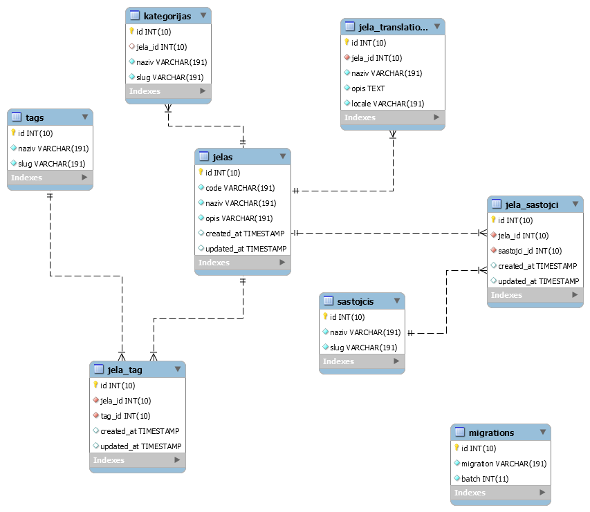

# Jela Svijeta

API Backend zadatak

### Api Usage v1

<>
| RESPONSE | API |
| ------ | ------ |
| Prikaz svih podataka iz baze | .../api/jela]
| Prikaži po tagu i tako baziraj upite | .../api/jela/find?tag=5
| Kombinacija filtriranja: | .../api/jela/find?tag=3&kategorija&sastojci
| Pretraga po Jelu |.../api/jela/find?&kategorija&sastojci&tags  |
| Filtriraj ako je prevedeno (Hrvatski=hr , Engleski = en...) |.../api/jela/find?tag=1&kategorija&sastojci&lang=en |
| Paginaciju moguče koristiti na kolekciji | .../api/jela?per_page=15]
|  |  |

Command:

```sh
$ php artisan napravi:jela
```
###### Pravi 2 jela koja imaju prijevod sa Hr i En (ukupno 4 novih jela u tablici JelaTranslations).

### Era


